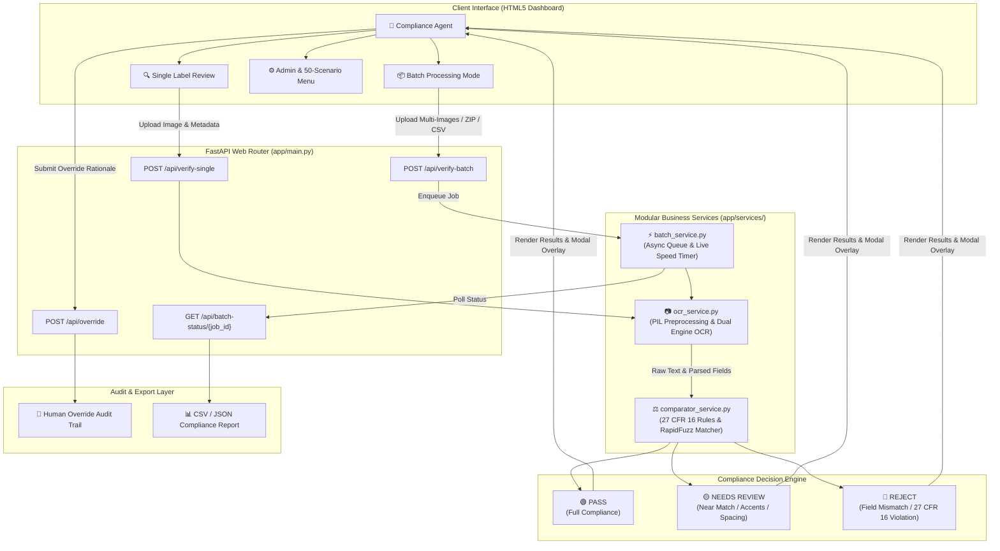
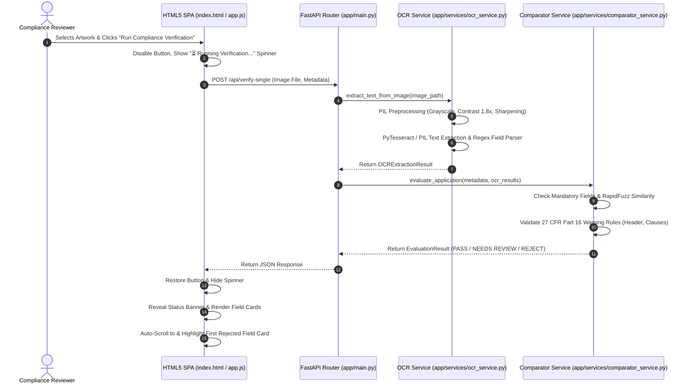

# TTB Label Compliance Review Assistant

## Solution Architecture Document

---

## 1. System Architecture & Component Flow

The TTB Label Compliance Review Assistant is an AI-assisted verification web application designed for compliance agents at the Alcohol and Tobacco Tax and Trade Bureau (TTB). The system features a **Python FastAPI** backend serving a responsive **HTML5 / Vanilla JavaScript Single Page Application (SPA)**, powered by a modular **OCR Extraction Engine**, a normalized **Fuzzy Matcher & 27 CFR Part 16 Regulatory Validator**, and an **Asynchronous Batch Queue Processor**.

### System Architecture Diagram

---

## 2. End-to-End Label Verification Sequence

---

## 3. Software Bill of Materials (BOM) & Licenses

To comply with federal open-source software governance and supply-chain auditing, all core dependencies are pinned to exact version numbers and audited for license compatibility.

| Library / Dependency | Version | Open Source License | Primary Purpose in System |
| :--- | :--- | :--- | :--- |
| **FastAPI** | `0.111.0` | MIT | High-performance asynchronous REST API backend web framework |
| **Uvicorn** | `0.30.1` | BSD-3-Clause | ASGI server for serving FastAPI endpoints |
| **Pydantic** | `2.7.4` | MIT | Data validation, request/response schema serialization |
| **Python-Multipart** | `0.0.9` | Apache-2.0 | Form data parsing for file uploads (CSV, PNG, JPEG) |
| **Pillow (PIL)** | `10.3.0` | HPND (BSD-like) | Image processing, resizing, format conversion, thumbnail rendering |
| **PyTesseract** | `0.3.10` | Apache-2.0 | Wrapper for Google Tesseract OCR engine |
| **EasyOCR** | `1.7.1` | Apache-2.0 | Deep learning-based local OCR extraction engine |
| **RapidFuzz** | `3.9.3` | MIT | C++ accelerated fuzzy string matching & token set ratio comparison |
| **OpenCV (Headless)**| `4.9.0.80`| Apache-2.0 | Image preprocessing (grayscale, adaptive thresholding, noise reduction) |
| **Pandas** | `2.2.2` | BSD-3-Clause | CSV metadata parsing, batch analysis, export formatting |

---

## 4. Core Subsystems

### 4.1 OCR Extraction Engine (`app/services/ocr_service.py`)
The system features a **Hybrid OCR Provider Interface**:
* **Local Provider (Default)**: Leverages `EasyOCR` / `PyTesseract` after OpenCV preprocessing (adaptive binarization and contrast stretching). Operates 100% offline within local network infrastructure with zero external network calls.
* **Optional Cloud Provider**: Triggered by setting environment variable `USE_CLOUD_OCR=true` and configuring `OPENAI_API_KEY`.

### 4.2 Field Normalization & Comparison (`app/services/comparator_service.py`)
Field comparison uses a multi-tier matching strategy:
* **String Normalization**: Unicode NFKD normalization, case-folding, punctuation strip, multi-space collapse.
* **Fuzzy Matcher**: RapidFuzz `token_set_ratio` algorithm to evaluate word permutations and slight OCR transcription variances.

#### Decision Threshold Matrix:
* **PASS (Score ≥ 80%)**: High confidence match.
* **NEEDS REVIEW (65% ≤ Score < 80%)**: Near match requiring agent verification.
* **REJECT (Score < 65% or Missing)**: Mismatched or absent mandatory field.

### 4.3 Strict Government Warning Validation (27 CFR Part 16)
The Government Warning statement is subjected to explicit regulatory rules:
1. **Mandatory Header**: Verifies presence of uppercase string `"GOVERNMENT WARNING:"`. If header is lowercase or missing, decision resolves to `REJECT`.
2. **Surgeon General Statement**: Verifies exact text regarding pregnancy risks and birth defects.
3. **Impairment Statement**: Verifies exact text regarding operating machinery or driving a car.

### 4.4 Asynchronous Batch Processor (`app/services/batch_service.py`)
* Uses Python `asyncio` background task queues.
* **Live Running Speed Metric**: Dynamically calculates running average processing speed ($t / n$) every 300ms.
* Target execution throughput: **≤ 5 seconds per label**.

---

## 5. Security & Governance

1. **Zero External Data Leakage**: Default local OCR mode operates completely isolated from external networks.
2. **Audit Logging**: Every validation output records timestamp, reviewer ID, extracted raw text, confidence score, decision, and human override logs.
